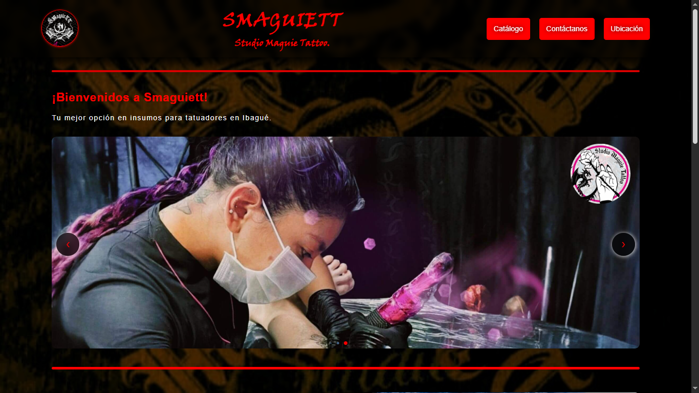
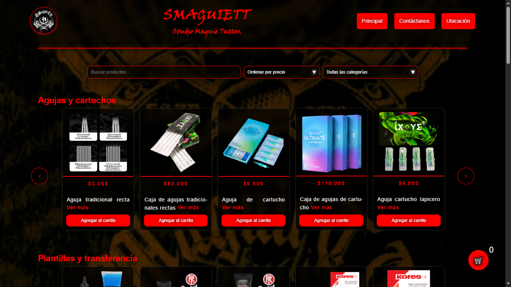
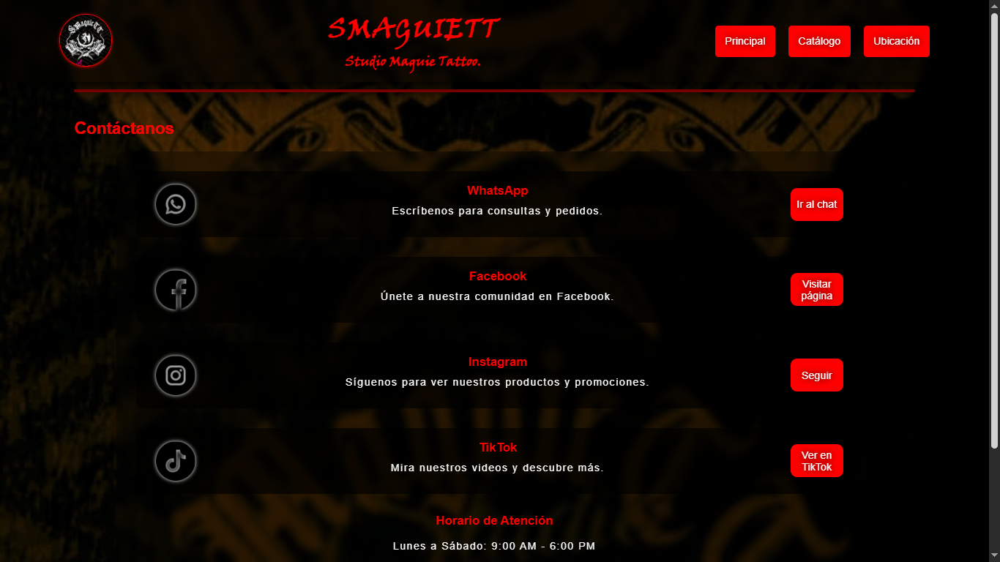
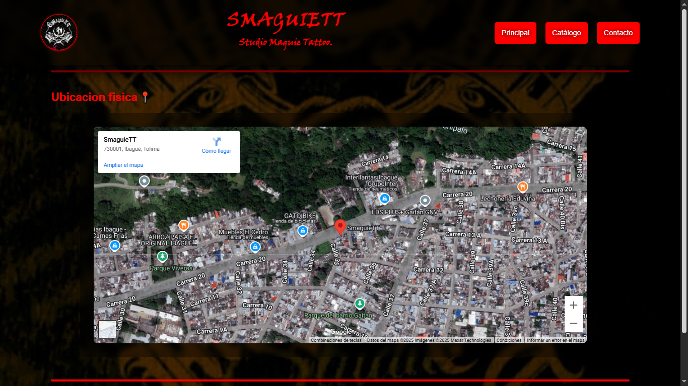

# 🖤 Smaguiett - Plataforma Web para Tienda de Suministros para Tatuajes  

**Smaguiett** es una aplicación web desarrollada para optimizar la experiencia de compra de insumos y cosméticos para tatuajes. Construida con un enfoque en rendimiento, accesibilidad y facilidad de uso, esta plataforma ofrece una navegación fluida y rápida, adaptándose a cualquier dispositivo.  

---
## 🚀 Desarrollo y Funcionalidad  

- **Catálogo Dinámico**: Permite explorar productos con una interfaz intuitiva y organizada.  
- **Carrito Interactivo**: Los usuarios pueden gestionar su compra en tiempo real antes de finalizar el pedido.  
- **Integración con WhatsApp**: Simplifica el proceso de compra al permitir que los pedidos se envíen directamente a la tienda.  
- **Notificaciones en Tiempo Real**: Utiliza Firebase Cloud Messaging para mantener informados a los usuarios sobre novedades y ofertas.  
- **Diseño Responsive**: Implementado con **Flexbox y Media Queries**, garantizando una experiencia óptima en PC, tablets y móviles.  
- **Optimización de Rendimiento**: Minimización de tiempos de carga y fluidez en la interacción.  

---

## 🛠️ Tecnologías Implementadas  

- **Frontend**: HTML, CSS y JavaScript, con una estructura modular y adaptable.  
- **Backend**: Node.js para la gestión del servidor y Firebase Firestore como base de datos en tiempo real.  
- **Control de Versiones**: GitHub para el seguimiento del desarrollo y colaboración en equipo.  
- **Hosting y Servicios en la Nube**: Firebase para almacenamiento y gestión de notificaciones.  

---

## 📸 Vista Previa

### 📱 Página Principal  


### 🛒 Catálogo de Productos  


### 🛍️ Carrito de Compras  


### 📞 Contacto  


### 🏠 Ubicación  


---

## 🔧 Instalación y Uso  

Para ejecutar el proyecto en un entorno local:  

```sh
git clone https://github.com/yasi6969/smaguiett.git

cd smaguiett
npm install

# Configurar Firebase (archivo .env con credenciales)

node server.js

# Ejecutar la aplicación
Abrir index.html en el navegador.
```
---

## 📩 Contacto y Desarrollo  

Este proyecto está en constante evolución, con mejoras en funcionalidad y rendimiento. Para más información:  

📧 **Correo:** santiagocn08@gmail.com  
📱 **WhatsApp:** +57 323 6869 420  
🔗 **Repositorio GitHub:** [Smaguiett](https://github.com/yasi6969/smaguiett)  

